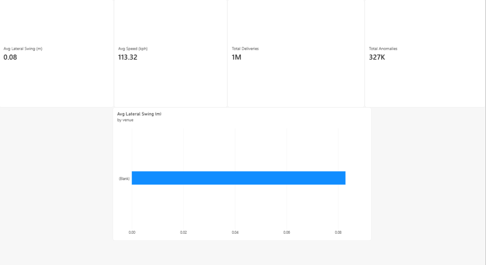
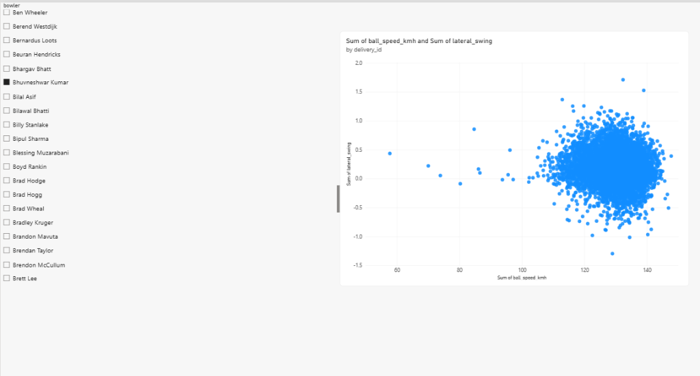
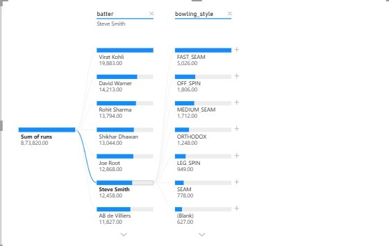
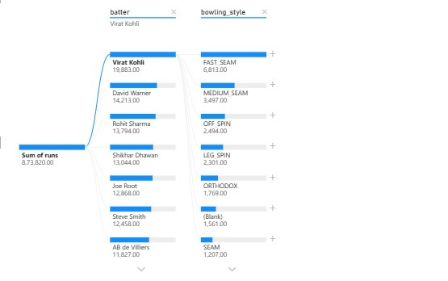
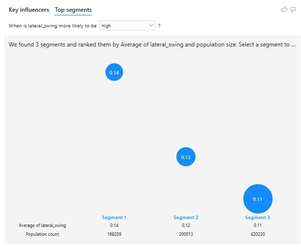
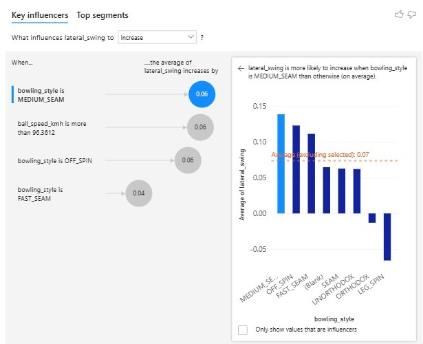
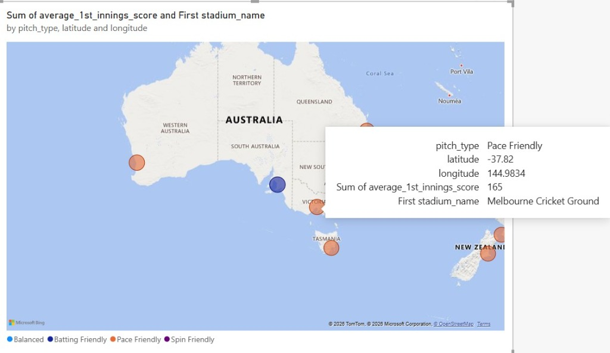
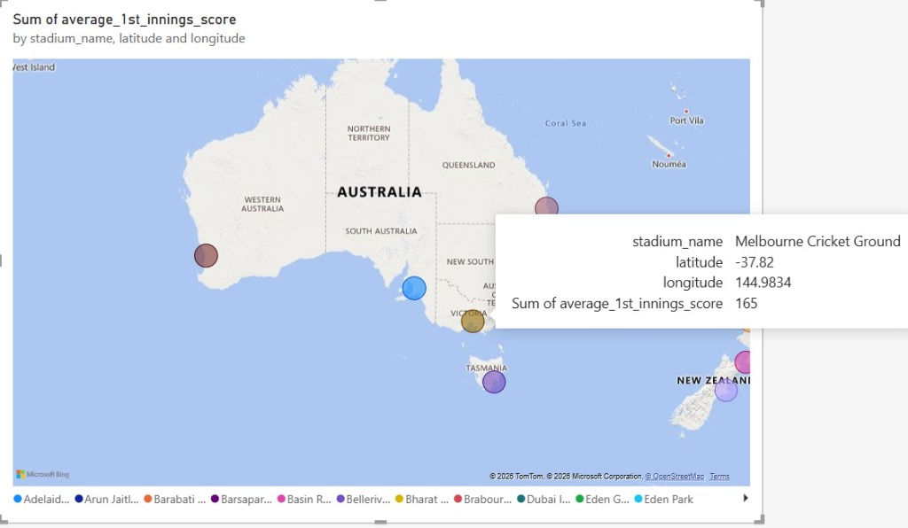

# Context-Aware Adaptive Cricket Ball Intelligence System (Dual Architecture)

A dual-architecture AIML framework for context-aware cricket analysis, trajectory intelligence, anomaly detection, computer vision, and real-time tactical prediction.

This system combines large-scale historical ball-tracking data with match context, weather, pitch characteristics, ball state, bowler profiles, physics-based modelling, machine learning, and computer vision.

The project is structured into two complementary architectures:
1. **Core Research Framework**: An offline research and modelling pipeline for large-scale trajectory analysis, physics simulation, anomaly detection, and explainability.
2. **Live Broadcast Companion**: A real-time AI system operating alongside live cricket broadcasts via a Chrome extension and FastAPI backend, analysing match context and predicting the very next delivery.

---

## 1. The Research Objective

The central question driving this project is:
> **Can cricket-ball behaviour be predicted more accurately by combining observed trajectory data with individualized bowler characteristics, release geometry, ball state, pitch conditions, venue, weather, and historical delivery context?**

Unlike conventional tracking systems that reconstruct *what happened*, this intelligence layer attempts to determine:
> **What *should* this delivery have looked like under current conditions, and how did the actual delivery differ from that expectation?**

The difference between expected and observed behaviour (the residual) is the foundation for our anomaly detection, contextual modelling, and real-time tactical prediction.

---

## 2. Dual Architecture Overview

```text
                         CRICKET DATA
                              |
                +-------------+-------------+
                |                           |
                v                           v
       CORE RESEARCH FRAMEWORK      LIVE BROADCAST COMPANION
                |                           |
                v                           v
       Historical Analysis           Live Match Context
                |                           |
                v                           v
       Physics + ML Models             FastAPI Engine
                |                           |
                v                           v
       Research Evaluation          Chrome Extension
```

- **Core Research Framework**: Designed for large-scale historical analysis, trajectory modelling, physics simulations, contextual feature engineering, ablation experiments, and SHAP explainability.
- **Live Broadcast Companion**: Designed for real-time match analysis, next-ball prediction, online learning, pitch and match-state analysis, and browser-based visualisation.

---

## 3. Architecture 1: Core Research Framework

Processes over 1.1 million historical delivery records (HawkeyeStats, CricSheet, Open-Meteo) to investigate how contextual variables affect cricket-ball behaviour.

### Key Components:
- **Data Ingestion Pipeline** (`src/ingestion/`): Merges Hawkeye tracking data, CricSheet match JSONs, and Open-Meteo weather data into a unified `master_dataset.parquet`.
- **Feature Engineering** (`src/features/`): Transforms raw data into context-aware features. Includes individualized bowler profiles, release geometry (x/y/z, velocity, arm slot), and evolving ball-state (accounting for ball age and wear over an innings).
- **Physics Modelling** (`src/models/physics/`): Simulates trajectories using physical factors (gravity, drag, Magnus effect) to provide a baseline expected trajectory.
- **Context-Aware Machine Learning** (`src/models/context_aware/`): Uses XGBoost to learn relationships between context (pitch, weather, bowler profile) and trajectory deviations. The final model is a composite: `Physics Prediction + ML Residual Correction`.
- **Anomaly Detection** (`src/models/anomaly/`): Flags deliveries whose observed behaviour differs substantially from the expected physics/ML baseline (e.g., unexpected swing, slower balls).
- **Explainability & Evaluation** (`src/evaluation/`, `src/explainability/`): Uses SHAP values and rigorous Ablation Studies to explain *why* the AI made a prediction and to mathematically prove the value of each feature.

---

## 4. Architecture 2: Live Broadcast Companion

A real-time interface for consuming the project's AI predictions during a live cricket match. It acts as a predictive overlay while you watch a match on platforms like Cricbuzz.

### Key Components:
- **Chrome Extension** (`src/extension/`): Monitors the live scorecard, extracts new commentary via DOM polling, and beautifully renders prediction cards, pitch heatmaps, and field radar overlays directly in your browser.
- **FastAPI Backend** (`src/api/main.py`): The real-time prediction service. It evaluates previous deliveries, manages short-term memory (database), retrieves historical context, and predicts the next ball.
- **Computer Vision & ST-MPDA** (`src/api/vision.py`, `pitch_analyzer.py`): Analyzes broadcast frames to estimate pitch conditions (grass, dust, dampness). Uses our custom **Spatio-Temporal Markovian Pitch Degradation Algorithm (ST-MPDA)** to dynamically model how the pitch wears over time, predicting Par Scores and Game Theory matrices.
- **Online Learning Engine**: The AI actively learns as you watch. After every ball, the backend compares its prediction against the actual outcome, extracts the delivery type, and automatically appends it to `historical_training_data.csv`, meaning the model trains itself in real-time.

---

## 5. How to Run

### Run the Core Research Framework (Offline)
```bash
python run_pipeline.py                    # Full data pipeline (Ingest, Models, Eval)
python run_pipeline.py --offline          # Skip external API requests
python run_pipeline.py --models-only      # Skip data prep, run models only
python run_pipeline.py --dashboard        # Launch Streamlit SHAP dashboard
```

### Run the Live Broadcast Companion (Real-time)
1. **Start the AI Backend**:
   ```bash
   python -m src.api.main
   ```
2. **Install the Extension**:
   - Go to `chrome://extensions/` in your browser.
   - Enable "Developer mode" & click "Load unpacked".
   - Select the `src/extension/` folder.
3. **Analyze Live**:
   - Open a live cricket match on Cricbuzz.
   - Click the **ENABLE VISION** button on the overlay.
   - The AI will evaluate pitch conditions, calculate Par Scores, and predict the exact pace, angle, and delivery type of the *next ball*!


# Analytics & Business Intelligence

A comprehensive **Data Analytics & Business Intelligence (BI)** layer has been added to PLUMB to translate raw physics and ML outputs into actionable insights.

## Architecture
- **Transformation (Python/Pandas)**: The massive master_dataset.parquet is sliced into an optimized **Star Schema** (act_deliveries, dim_bowler, dim_match, etc.) located in data/bi/.
- **Execution Engine (DuckDB)**: Advanced analytical SQL queries (CTEs, Window Functions, Ranking) execute directly against the Parquet files via DuckDB (src/bi/execute_sql.py) without requiring a heavy Postgres server.
- **Presentation (Power BI)**: A professional, interactive Power BI dashboard utilizing complex **DAX Measures** connects directly to the Parquet schema.

## Generating the BI Data
`ash
# Generate the optimized Star Schema Parquet files
python src/bi/transformations.py

# Execute advanced SQL analytics engine
python src/bi/execute_sql.py
`

## Power BI Integration
To view the analytics dashboard, open Power BI Desktop, import the Parquet files from data/bi/, establish the 1-to-many Star Schema relationships in the Model View, and implement the DAX measures outlined in powerbi/dax_measures.md.

For a full breakdown of the analytical metrics and table structures, please refer to the docs/BI_DATA_DICTIONARY.md.


# Analytics & Business Intelligence

A comprehensive **Data Analytics & Business Intelligence (BI)** layer has been added to PLUMB to translate raw physics and ML outputs into actionable insights.

## Architecture
- **Transformation (Python/Pandas)**: The massive master_dataset.parquet is sliced into an optimized **Star Schema** (act_deliveries, dim_bowler, dim_match, etc.) located in data/bi/.
- **Execution Engine (DuckDB)**: Advanced analytical SQL queries (CTEs, Window Functions, Ranking) execute directly against the Parquet files via DuckDB (src/bi/execute_sql.py) without requiring a heavy Postgres server.
- **Presentation (Power BI)**: A professional, interactive Power BI dashboard utilizing complex **DAX Measures** connects directly to the Parquet schema.

## Generating the BI Data
` ash
# Generate the optimized Star Schema Parquet files
python src/bi/transformations.py

# Execute advanced SQL analytics engine
python src/bi/execute_sql.py
`

## Power BI Integration
To view the analytics dashboard, open Power BI Desktop, import the Parquet files from data/bi/, establish the 1-to-many Star Schema relationships in the Model View, and implement the DAX measures outlined in powerbi/dax_measures.md.

For a full breakdown of the analytical metrics and table structures, please refer to the docs/BI_DATA_DICTIONARY.md.


## Power BI Dashboard Showcase

Below are previews of the dynamic Business Intelligence dashboard built on top of the physics and ML data, demonstrating complete Data Analytics capabilities.

### Overview Dashboard


### Bowler Intelligence Deep-Dive (Bhuvneshwar Kumar)


### Batter Runs Decomposition Tree (Steve Smith)


### Batter Runs Decomposition Tree (Virat Kohli)


### "Magic Ball" Anomaly Scatter Plot (Physics Outliers)


### AI Physics Analyzer: Key Influencer Segments


### AI Physics Analyzer: Key Influencer Bar Chart


### Geospatial Global Stadium Map (Pitch Type Legend)


### Geospatial Global Stadium Map (Stadium Legend)

